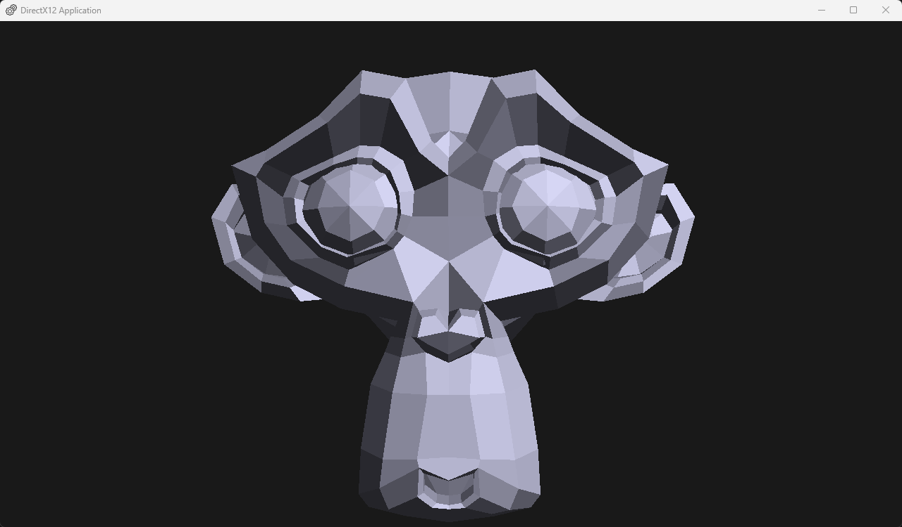

## Glad to see you, my name is [Daniil](https://t.me/Shemetov_Daniil) 👋
🎓 I am a 21-year-old , 3rd-year Software Engineering student at Lobachevsky University (UNN), Institute of ITMM. My cumulative GPA is 4.3/5.\
I am interested in computer graphics, as well as parallel and low-level programming, and I want to develop in this field.

## Skills
- **Developing**: `C++20`, `C`
- **Core Competencies**: `Algorithms & Data Structures`, `OOP`, `Computer Architecture`, `Operating Systems Internals`, `Memory Management`
- **Testing & Quality**: `Unit Testing (GTest)`, `Clang-format`, `pre-commit hooks`
- **Graphics API**: `DirectX 12`
- **Concurrency & Parallelism**: `Multi-threading (std::thread / std::jthread)`, `Intel Threading Building Blocks (TBB)`, `OpenMP`, `MPI`
- **Tools & Environment**: `CMake`, `Git`, `PowerShell / Bash scripting`, `Windows`, `Linux`
- **Languages**: `English (C1 Certified)`, `Russian (Native)`

## 💻Projects
🎮[Graphics Pet Project](https://github.com/7RosenRot/DirectX12Engine) - My main pet project, which I continuously develop and improve.

- **Developing**: `C++20`
- **Graphics API**: `DirectX 12`
- **Project Configuration**: `CMake`, `DebugView`
- **Target OS**: `Windows`

  

    
  

## 📋CV
- *If you wish to learn more about me, you should check my Extended CV - [Resume](https://github.com/7RosenRot/7RosenRot/blob/main/resume.pdf)*

<!--
**7RosenRot/7RosenRot** is a ✨ _special_ ✨ repository because its `README.md` (this file) appears on your GitHub profile.

Here are some ideas to get you started:

- 🔭 I’m currently working on ...
- 🌱 I’m currently learning ...
- 👯 I’m looking to collaborate on ...
- 🤔 I’m looking for help with ...
- 💬 Ask me about ...
- 📫 How to reach me: ...
- 😄 Pronouns: ...
- ⚡ Fun fact: ...
-->
